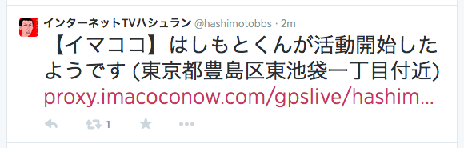

imakoko radar
==
monitoring imakoko user activity and tweet when the activity start is detected.



setup
--
````
pyenv virtualenv 3.3.3 imakoko-radar-3.3.3
pyenv local imakoko-radar-3.3.3
pip install -r requirements.txt
````

start & stop
--
````
./radar.sh start
./radar.sh stop
````

monitoring example using cron
--
see `radar.sh` inside for details of monitoring.
````
* * * * * /path/to/imakoko-radar/radar.sh monitor >> /path/to/imakoko-radar/log/monitor.log 2>&1
````

license
--
MIT License.
copyright (c) 2013 honishi, hiroyuki onishi
